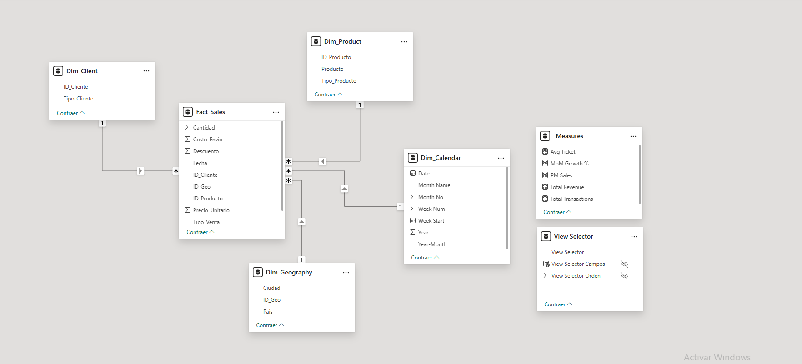
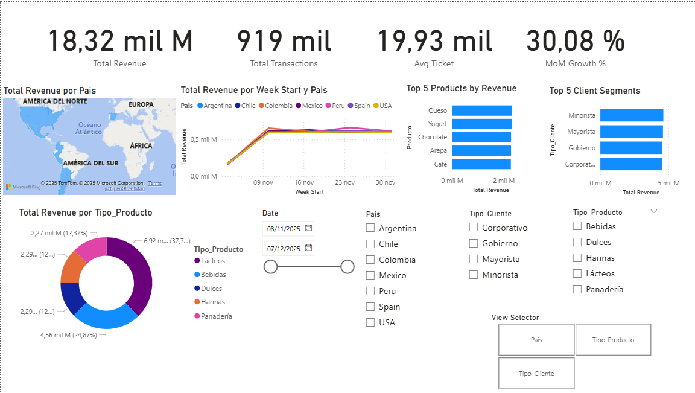

# 📊 RIWI Sales Analytics & Business Intelligence


## 📖 Context & Objective
**Role:** Data Analyst  
**Client:** RIWI (Advanced Analytics Solutions)  
**Goal:** Build a robust end-to-end BI solution to optimize commercial decision-making. The project involves ingesting raw sales data, architecting a SQL data warehouse, and deploying an interactive Power BI dashboard to visualize KPIs, trends, and regional performance.

---

## 🏗️ Architecture & Workflow

The solution follows a modern **ELT (Extract, Load, Transform)** and **BI** pipeline:

1.  **Ingestion (Python):** Automated generation of SQL Schema from CSV and staging load (`raw_sales`).
2.  **Cleaning & Enrichment (Python):** 
    *   **Regex** cleaning for special characters.
    *   **Geospatial Mapping** (City $\to$ Country) to fix map visualization issues.
    *   **Logical Fixes** for inconsistent product categories.
    *   **Data Integrity Gate:** Mathematical audit to filter out inconsistent transactions (~2% of data).
3.  **Storage (PostgreSQL):** Data warehousing in a local PostgreSQL instance (`clean_sales`).
4.  **Modeling (Power BI):** Transformation into a **Star Schema** using Power Query.
5.  **Visualization:** Interactive Dashboard with DAX measures and field parameters.

---

## 📂 Project Structure

```bash
riwi-sales-analytics/
│
├── data/
│   └── raw/                        # Local storage for raw 'RWVentas.csv' (Ignored by Git)
│
├── docs/                           # Documentation assets
│   ├── images/                     # Screenshots of Dashboard & Model
│   ├── EXECUTIVE_REPORT.md         # 📄 Full Business Analysis Report (C-Level)
│   └── EXECUTIVE_REPORT.pdf        # PDF version of the report
│
├── notebooks/
│   ├── 01_etl_ingestion.ipynb      # Schema generation & Staging load
│   ├── 02_data_cleaning.ipynb      # Regex cleaning, Country mapping & Normalization
│   └── 03_eda.ipynb                # Exploratory Data Analysis & Validation
│
├── reports/
│   ├── Riwi_Sales_Dashboard.pbip   # Power BI Project (Version Control friendly)
│   ├── Riwi_Sales_Dashboard.Report/
│   ├── Riwi_Sales_Dashboard.SemanticModel/
│   └── Riwi_Sales_Dashboard.pbix   # Binary backup
│
├── sql/
│   └── schema.sql                  # Auto-generated SQL DDL script
│
├── src/
│   ├── __init__.py
│   └── db_connection.py            # Reusable Database Connection Module
│
├── .env                            # DB Credentials (Not committed)
├── requirements.txt                # Python dependencies
└── README.md                       # Main technical documentation
```

---

## 🛠️ Technical Implementation Steps

### 1. Database Connection & Preparation
*   **Module:** `src/db_connection.py` uses `SQLAlchemy` and `python-dotenv` for secure, environment-variable-based connection to PostgreSQL.
*   **Schema Automation:** The script automatically detects column types from the CSV and generates a compliant SQL `CREATE TABLE` script (saved in `sql/schema.sql`).

### 2. Data Cleaning & Transformation
*   **Artifact Removal:** Applied Regex `r'[^\w\s]'` to remove noise like `***` or `@@@` found in 15k+ records.
*   **Enrichment:** A dictionary mapping strategy was implemented to assign a **Country** to each City, ensuring accurate geolocated visualizations in Power BI.
*   **Normalization:** Standardized product categories (e.g., reclassifying "Leche" from "Hogar" to "Lácteos").

### 3. Data Modeling (Star Schema)
Transformed the flat table into a Star Schema within Power Query to optimize performance:
*   **Fact Table:** `Fact_Sales` (Transactions).
*   **Dimension Tables:** `Dim_Product`, `Dim_Client`, `Dim_Geography` (Country/City hierarchy), and `Dim_Calendar` (DAX).



### 4. Visualization & DAX
*   **Measures:** Created dedicated DAX measures for `Total Revenue`, `Total Transactions`, `Avg Ticket`, and `MoM Growth %`.
*   **Granularity Strategy:** Due to data available only for **Nov-Dec 2025**, the analysis pivoted from "Year-over-Year" to **"Weekly Trend"** to provide meaningful insights.
*   **Dynamic Features:** Implemented **Field Parameters** to allow users to toggle views between *Country*, *Client*, and *Product* dynamically.



---

## 💡 Key Insights & Recommendations

> *For a detailed business analysis, please refer to the [**Executive Report**](./docs/EXECUTIVE_REPORT.md).*

1.  **📉 Technical/Seasonal Drop:** A sharp revenue decline (>40%) was observed in December compared to November. This requires an immediate data governance audit to rule out ingestion latency or confirm end-of-season effects.
2.  **🌍 Market Uniformity:** Revenue is distributed almost identically across all 7 countries. This suggests market saturation and a need for localized, aggressive marketing campaigns in high-GDP regions (USA/Mexico) to break the plateau.
3.  **💼 B2B Volatility:** High standard deviation in sales suggests dependency on "whale" clients (Corporate/Gov). A **Retail Loyalty Program** is recommended to stabilize daily cash flow.

---

## 🚀 Setup & Execution

1.  **Clone the repository:**
    ```bash
    git clone https://github.com/Elimge/riwi-sales-analytics.git
    cd riwi-sales-analytics
    ```

2.  **Install Dependencies:**
    ```bash
    python -m venv venv
    # Activate venv (Windows: .\venv\Scripts\activate | Linux: source venv/bin/activate)
    pip install -r requirements.txt
    ```

3.  **Database Setup:**
    Create a `.env` file with your PostgreSQL credentials:
    ```ini
    DB_USER=postgres
    DB_PASSWORD=your_password
    DB_HOST=localhost
    DB_PORT=5432
    DB_NAME=riwi_ventas_db
    ```

4.  **Run ETL:** Execute notebooks `01`, `02`, and `03` sequentially.
5.  **View Dashboard:** Open `reports/Riwi_Sales_Dashboard.pbip` in Power BI Desktop.

---

## 👤 Author
* **Miguel Canedo Vanegas** - *Data Engineer & BI Developer*  
* Github: [`@Elimge`](https://github.com/Elimge)
* **Email:** elimge@outlook.com