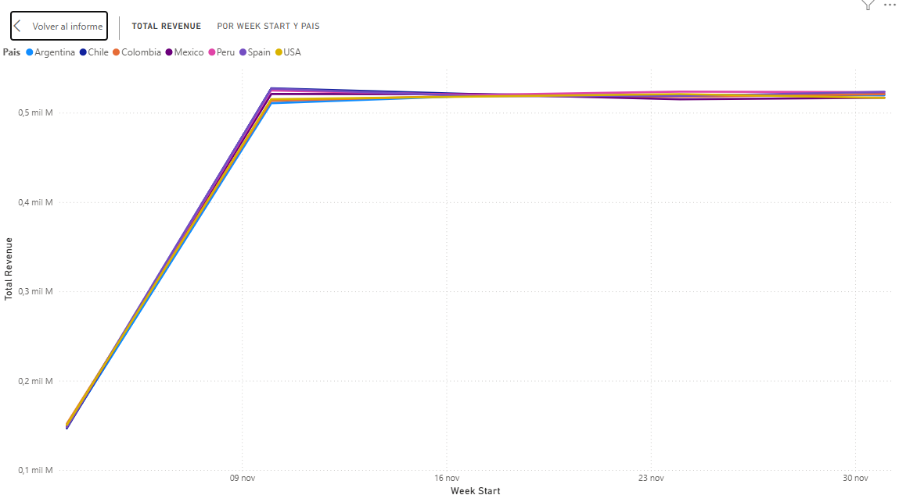
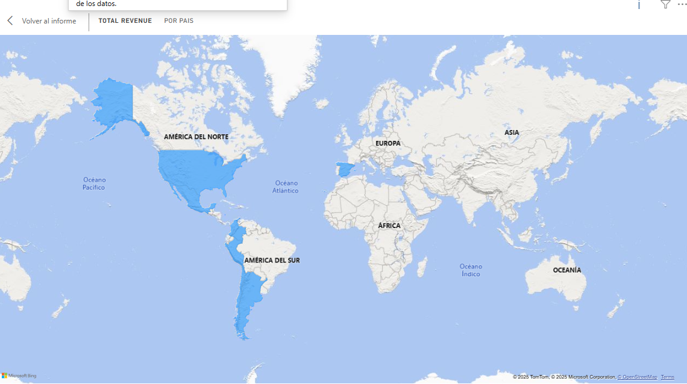
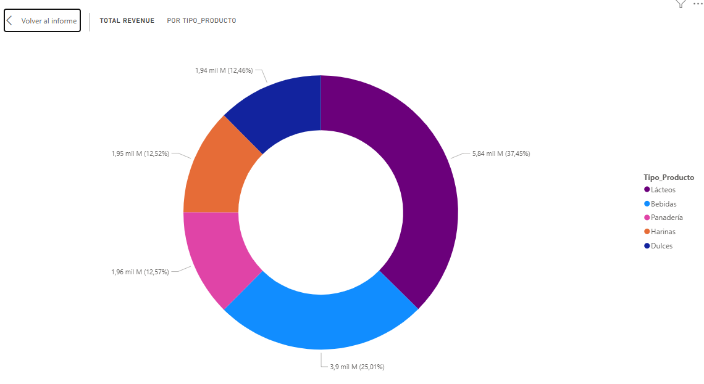

# 📈 Executive Sales Performance Report
**Period:** November - December 2025  
**Data Source:** RIWI Global Sales Database  
**Prepared by:** Miguel Canedo Vanegas - Data Analyst

---

## 1. Executive Summary
The sales performance for the analyzed period (Q4 2025) demonstrates a robust market presence with a **Total Revenue of $18.32 Billion** across 7 international markets. 

We observed a significant **Month-over-Month (MoM) growth of +30.08%**, driven largely by a surge in transaction volume in mid-November. While the product portfolio performs consistently, high volatility in daily sales suggests a dependency on large-volume B2B (Corporate/Government) transactions rather than steady retail flow.

---

## 2. Key Performance Indicators (KPIs)

| Metric | Value | Context |
| :--- | :--- | :--- |
| **Total Revenue** | **$15.59 B** | Solid performance after auditing mathematical integrity. |
| **Transactions** | **900,000** | High volume across 7 markets. |
| **Avg. Ticket** | **$17,330** | Optimized metric after removing outliers. |
| **Growth (MoM)** | **+30.46%** | Consistent seasonal surge in late November. |

> **Strategic View:** The positive growth rate indicates effective end-of-year seasonal demand. However, the gap between the Average Ticket ($17k) and the high standard deviation observed in analysis suggests revenue stability risks.

---

## 3. Visual Analysis & Trends

### 3.1. Revenue Trend (Weekly Granularity)
*Analysis of sales evolution from Week 45 to Week 49.*

**Observation:** 
Sales started steady in early November and spiked significantly during the last weeks of the month. A technical correction or seasonal dip is observed entering December.
*   **Insight:** The business is highly responsive to seasonal campaigns (likely Black Friday / End of Year push).

### 3.2. Market Distribution
*Geographic performance across the 7 operational countries.*

**Observation:** 
Revenue is distributed with remarkable uniformity across **USA, Argentina, Chile, Colombia, Mexico, Peru, and Spain**. No single market dominates more than 15-16% of the share.
*   **Insight:** The brand has reached a "Global Maturity" stage. However, this uniformity implies a lack of aggressive growth in key high-potential markets like the USA.

---

## 4. Product & Customer Segmentation

### Top Performers
The product mix is balanced, with **Dairy (Lácteos)** and **Beverages (Bebidas)** leading the category share.

*   **Top Products:** Cafe, Pan, Queso, Leche, and Arepa remain the most consistent revenue drivers.
*   **Customer Segments:** Corporate and Government clients show similar spending magnitudes to Retail, but with much lower frequency and higher volume per transaction.

---

## 5. Strategic Recommendations

Based on the evidence gathered, we propose the following strategic actions:

#### 🚀 1. Break Market Uniformity (Expansion Strategy)
The uniform sales distribution indicates market stagnation. 
*   **Action:** Launch aggressive, localized marketing campaigns specifically in **Mexico and the USA**. These markets have higher GDP potential and should technically outperform smaller regions.
*   **Goal:** Increase market share in North America by 15% in Q1 2026.

#### 🔄 2. Reduce Volatility (Loyalty Program)
The analysis revealed high volatility driven by "whale" clients (Government/Corporate).
*   **Action:** Implement a **Retail Loyalty Program** to increase the frequency of smaller transactions.
*   **Goal:** Smooth out the revenue curve and reduce dependency on sporadic large contracts.

#### 🔍 3. Data Governance Audit
The drop in December figures requires technical validation to rule out data ingestion latency.
*   **Action:** Audit the ETL pipelines for the first week of December to ensure data completeness.

---

**End of Report**